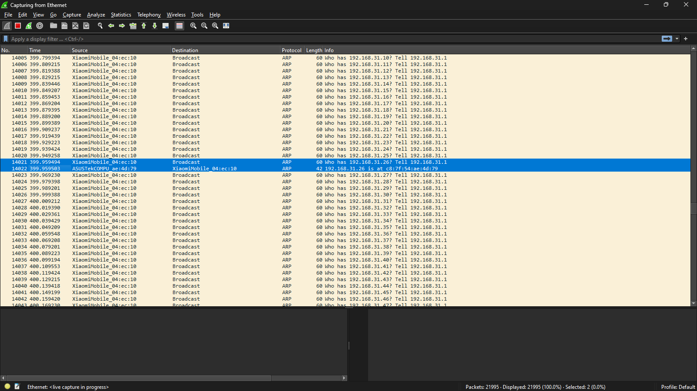

# Address Resolution Protocol  (ARP)

Address Resolution Protocol (ARP) is a protocol or procedure that connects an ever-changing Internet Protocol (IP) address to a fixed physical machine address, also known as a media access control (MAC) address, in a local-area network (LAN). 

This mapping procedure is important because the lengths of the IP and MAC addresses differ, and a translation is needed so that the systems can recognize one another. The most used IP today is IP version 4 (IPv4). An IP address is 32 bits long. However, MAC addresses are 48 bits long. ARP translates the 32-bit address to 48 and vice versa.

