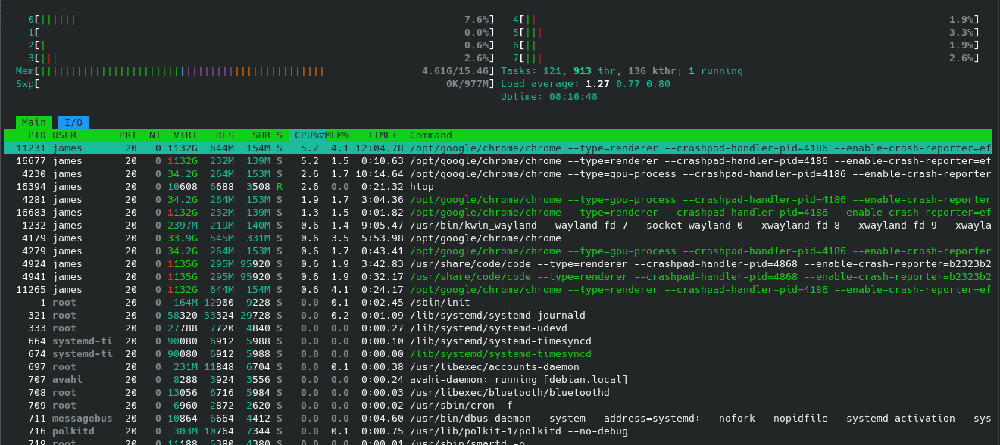

# Processes in linux

we can check exist processes using the command **ps**, and we can get all processes running for specific user or others, and we can get help by 

```bash
james@debian:~$ ps --help simple

Usage:
 ps [options]

Basic options:
 -A, -e               all processes
 -a                   all with tty, except session leaders
  a                   all with tty, including other users
 -d                   all except session leaders
 -N, --deselect       negate selection
  r                   only running processes
  T                   all processes on this terminal
  x                   processes without controlling ttys

For more details see ps(1).
```

and there is a nice tool with cool gui called **htop** to have nice look on the processes


and here is the description: https://medium.com/starbugs/do-you-understand-htop-ffb72b3d5629

## types of processes

there are two types of processes

- foreground
    for a foreground process, we can do:

    1. ctrl+c/ kill [ID] to kill it
    2. ctrl+z to pause it

- background
    processes that we can't interact other than killing it unless we move it to foreground

```bash
jobs #list jobs
fg [ID] #putting jobs to foreground
bg [ID] #putting jobs to backgound
```
