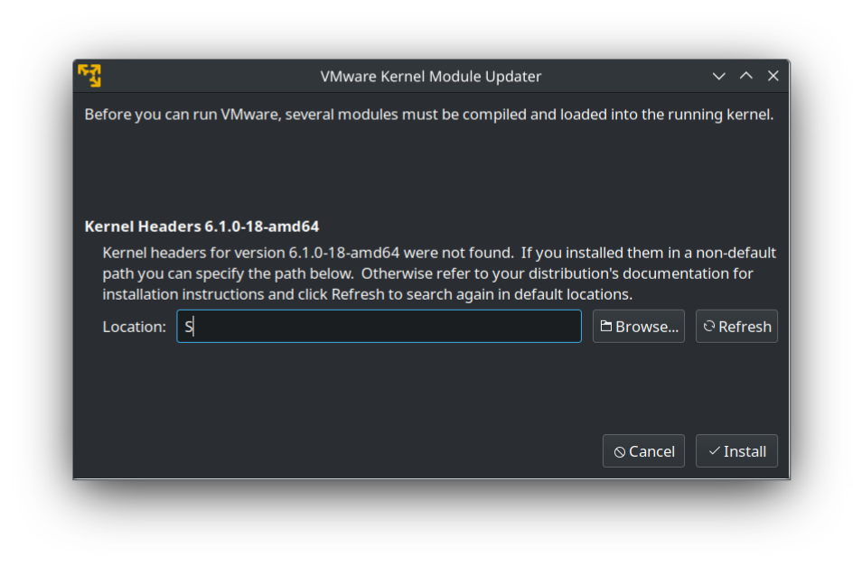

# troble-shotting VMware Kernel module

problem show below after doing **sudo apt install vmware**

to solve this, do **sudo apt install [kernal]**, where kernal is the one you will see by typing **neofetch**, after installing, see if linux-header is sitting in the dir **/usr/src**, if it is, then give a reboot and try to install vmware again.